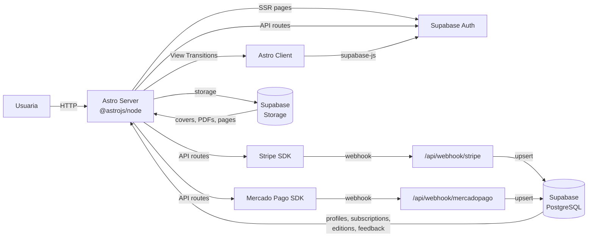

# TRIBA — Contexto de proyecto

Revista digital mensual escrita por y para mujeres, sobre cultura, arte, identidad. Modelo de suscripción con newsletter gratuito + suscripción paga (acceso a revista completa, archivo, descarga PDF).

---

## Stack

| Capa | Tecnología |
|---|---|
| Framework | **Astro 5** (server output con `@astrojs/node` standalone) |
| Estilos | **Tailwind CSS 3** — mobile-first, colores/fuentes del branding |
| BBDD / Auth / Storage | **Supabase** (PostgreSQL, auth, storage para PDFs/portadas) |
| Pagos | **Stripe** + **Mercado Pago** (webhooks + Supabase) |
| Visor revista | **react-pageflip** (React island) |
| JS | Mínimo. Solo islands interactivos y scripts puntuales. |

---

## Sistema visual

### Colores

| Token | Hex | Uso |
|---|---|---|
| `triba-red` | `#E91A39` | Logo, CTAs, acentos |
| `triba-pink` | `#FFCCE4` | Fondos de sección, highlights |
| `triba-cream` | `#FFF8EE` | Fondo principal secciones |
| `triba-light-cream` | `#FDEDD5` | Variante fondo |
| `triba-green` | `#BCE85E` | Highlight "Hecho por y para mujeres" |
| `triba-blue` | `#3BACFF` | Acentos secundarios |
| `triba-darkblue` | `#1800AD` | Azul eléctrico |
| `triba-white` | `#FFFFFF` | Fondos cards, botones |
| `triba-black` | `#000000` | Texto principal |
| `triba-brown` | `#35220A` | Texto sobre fondo claro |
| `triba-bone` | `#f2f1eb` | Fondo general del sitio |

### Tipografía

| Uso | Fuente |
|---|---|
| Logo | Lettering manual ilustrado → SVG/imagen |
| Títulos | **Bootzy TM** → Helvetica / Arial |
| Cuerpo | **Montserrat** → Helvetica / Arial |
| Cursiva destacada | **Times New Roman** itálica |

### Fondos decorativos

`fondo-cielo.webp`, `fondo-1.png`, `fondo-3.png`

---

## Navegación

| Rol | Items |
|---|---|
| Público | INICIO · REVISTA · SUSCRIBIRME · TRIBA CREATORS · [INICIAR SESION] |
| Suscriptora | Logo · MI CUENTA · REVISTA |

---

## Páginas

| Ruta | Archivo | Qué hace |
|---|---|---|
| `/` | `index.astro` | Hero, galería parallax, cards, newsletter, CTA creators |
| `/suscribirme` | `suscribirme.astro` | Pricing EUR/USD/ARS, 2 botones de pago (Stripe/MP), FAQ |
| `/iniciar-sesion` | `iniciar-sesion.astro` | Login + signup + recuperación de contraseña con Supabase Auth. Toggle entre Login y Crear cuenta. `emailRedirectTo` preserva `redirect` para que tras confirmar email el usuario vuelva al destino original. |
| `/revista` | `revista.astro` | Edición destacada, carrusel, visor page-flip |
| `/mi-cuenta` | `mi-cuenta.astro` | Dashboard suscriptora, edición actual, carrusel, archivo, visor, feedback |
| `/triba-creators` | `triba-creators.astro` | Info + formulario para creators |
| `/revista/[slug]` | `[slug].astro` | Vista de edición con page-flip |
| `/privacidad` | `privacidad.astro` | Política de privacidad |
| `/admin` | `admin/index.astro` | Dashboard admin (contadores + acciones rápidas) |
| `/admin/ediciones` | `admin/ediciones/index.astro` | Listado de ediciones con miniatura + estado |
| `/admin/ediciones/nuevo` | `admin/ediciones/nuevo.astro` | Form de creación (subir cover + PDF, marcar featured) |
| `/admin/ediciones/[id]` | `admin/ediciones/[id].astro` | Form de edición + preview de páginas |
| `/admin/suscriptoras` | `admin/suscriptoras.astro` | Listado de suscriptoras con cancel manual |
| `/admin/feedback` | `admin/feedback.astro` | Mensajes de feedback recibidos |
| `/admin/creators` | `admin/creators.astro` | Postulaciones de Triba Creators con aprobar/rechazar |
| `/terminos` | `terminos.astro` | Términos y condiciones legales |

---

## Componentes

| Componente | Props clave |
|---|---|
| `Button.astro` | `variant` (primary/default/ghost), `size` (sm/md), `href`, `fullWidth`, `type` (button/submit/reset) |
| `CheckoutButton.astro` | `provider` (stripe/mercadopago), `currency` (EUR/USD/ARS) |
| `MagazineCard.astro` | `number`, `title`, `description`, `image`, `coverId` |
| `MagazineCarousel.astro` | `editions`, `selectedId` |
| `MagazineSlider.astro` | `items` (cover, badge?, title?, description?), `selectedId?`. Mobile-only (`md:hidden`), snap horizontal con dots, sin flechas. Reutilizado en index y revista. |
| `Navbar.astro` | `session` (SSR, variante logueada/anónima) |
| `NewsletterForm.astro` | — |
| `Input.astro` | `label`, `name`, `type`, `required`, `placeholder`, `isTextarea` |
| `PatchTitle.astro` | `content`, `tag`, `lines`, `centered`, `class` |
| `PageFlipViewer.tsx` | `pages`, `width`, `height` |
| `admin/AdminLayout.astro` | `title`, `active` ("dashboard" / "ediciones" / "suscriptoras" / "feedback" / "creators"). Sidebar + header con logout. |
| `admin/EditionForm.astro` | `mode` ("create" / "edit"), `edition?` (objeto `Edition` para prellenar). Form reusable para crear/editar. |
| `PageFlipViewer.tsx` | `pages`, `width`, `height` |
| `Footer.astro` | — |

---

## API (server routes)

| Ruta | Método | Propósito |
|---|---|---|
| `/api/create-checkout` | POST | Crea sesión Stripe o MP, devuelve URL |
| `/api/portal` | POST | Redirige a Stripe Customer Portal. Usado desde `mi-cuenta.astro` (botón "Gestionar suscripción" para provider=stripe; MP muestra texto informativo). |
| `/api/cancel-subscription` | POST | Cancela suscripción en proveedor + DB |
| `/api/newsletter` | POST | Suscripción al newsletter gratuito. Rate limit 5/min por IP. |
| `/api/subscription-status` | GET | Polling de estado de suscripción (usado desde mi-cuenta para auto-reload suave) |
| `/api/feedback` | POST | Envía feedback de la edición. Auth + rate limit 60s server-side. Usado desde `mi-cuenta.astro`. |
| `/api/webhook/stripe` | POST | Eventos de suscripción Stripe (con verificación de firma) |
| `/api/webhook/mercadopago` | POST | Notificaciones de pago MP. Verificación de firma HMAC-SHA256 activa (fail-closed, manifest aislado en `buildManifest`). Default `VERIFY_SIGNATURES=true`; override con `VERIFY_MP_SIGNATURES=false` en env. |
| `/api/admin/editions` | POST | Crea una edición. Acepta `multipart/form-data` con cover/PDF opcionales (subidos a Supabase Storage). Promueve/demueve featured atómicamente. |
| `/api/admin/editions/[id]` | PATCH / DELETE | Actualiza o elimina una edición. |
| `/api/admin/creators/[id]/status` | PATCH | Aprueba/rechaza una postulación. Body: `{ status: 'approved' \| 'rejected' \| 'pending' }` |
| `/api/admin/subscribers/[id]/cancel` | POST | Cancela la suscripción de cualquier user (usa RPC `cancel_subscription`). Admin-only. |

---

## Convenciones

### Naming
- Archivos: `kebab-case.astro` (páginas, componentes) o `kebab-case.ts` (scripts, endpoints).
- Componentes: `PascalCase` en el nombre del archivo y de la clase/componente.
- Variables, funciones, props: `camelCase`.
- Tipos e interfaces: `PascalCase`.

### Astro
- Páginas en `src/pages/`: frontmatter con `Layout` wrapper, metadata SEO (`title`, `description`, `canonical`).
- Componentes: `Props` interface exportada, destructuring en frontmatter.
- Client-side JS: `<script>` al final del `.astro` (nunca inline en el HTML). Sigue el patrón de `astro:page-load` para View Transitions (ver quirks).
- `data-*` attributes para hooks del DOM que el JS necesita (ej. `data-slider-root`, `data-banner`, `data-subscription-status`).

### Server routes (`src/pages/api/`)
Patrón estándar:
- `export const POST: APIRoute = async ({ request }) => { ... }`.
- Auth vía `requireUser(request)` → devuelve `{ user, token }` o `error("Unauthorized", 401)`. Para admin: `requireAdmin(locals)`.
- Operaciones privilegiadas (webhooks, admin, rate limit): `supabaseAdmin` (service role).
- Operaciones del usuario actual (con su permiso): `supabase` con el token.
- Respuestas con helpers de `src/lib/response.ts`: `ok(data)` para 200, `error(msg, status)` para errores.
- Rate limiting con `src/lib/rate-limit.ts`: `checkRateLimit(rateLimitKey(ip, endpoint), { maxRequests, windowMs })`.
- Logging con Pino via `src/lib/logger.ts`: `logger.info({...}, "msg")`.
- `Content-Type: application/json` siempre.
- Body JSON: validar y sanear. `trim()` en strings, length check, tipos.

### Estilos
- Tailwind utility-first. Mobile-first (`md:`, `lg:`, `xl:`, `2xl:` para breakpoints más grandes).
- Colores y fuentes del branding via tokens de Tailwind (`bg-triba-red`, `font-heading`, etc.).
- Estilos complejos scopeados en `<style>` block dentro del `.astro`.
- Ver el quirk sobre `hidden md:block` vs `hidden md:grid`.

### i18n
- UI: español rioplatense con voseo ("iniciá sesión", "querés suscribirte", "suscribite").
- Código, comentarios, mensajes de log, mensajes de error que solo ve el dev: inglés.
- Mensajes de error que ve el usuario final: español.

### Migraciones Supabase
- `supabase/migrations/NNN_name.sql` con prefijo numérico secuencial (3 dígitos).
- Aplicar en orden. No renumerar migraciones ya aplicadas.
- Cada migración debe ser idempotente donde sea posible (`create table if not exists`, `create or replace function`, `drop policy if exists` antes de `create policy`).

### Git
- Mensajes de commit en presente, descriptivos ("Add signup UI", "Fix navbar glassmorphism"). Conventional Commits opcional.
- No commitear `.env` ni secrets (verificar `.gitignore`).

---

## Known quirks

Cosas que ya sabemos que tienen trampa. Si vas a tocar estas áreas, leé esto primero — te ahorrás tiempo y bugs.

### `hidden md:block` pisa `display: grid`
Tailwind cascadea las utilidades de `display` por orden en el CSS generado. `md:block` (`display: block`) **pisa** a `grid-cols-*` (`display: grid`) si están en el mismo elemento. Resultado: en desktop el grid se renderiza como block, los hijos se apilan verticalmente y se vuelven gigantes. **Fix:** usar `hidden md:grid` (o `hidden md:flex`) en vez de `hidden md:block` cuando el elemento usa grid/flex.

### Navbar glassmorphism casi invisible sobre fondo bone
El navbar desktop usa `bg-triba-bone/80 backdrop-blur-sm` y la mayoría de las páginas tienen `bg-triba-bone`. El `backdrop-filter: blur()` sobre un fondo mayormente uniforme devuelve el mismo color, así que el efecto glass apenas se nota. Solo se ve bien sobre la home donde el fondo es la imagen `fondo-cielo.webp` (alto contenido visual). Si querés glass visible en todas las páginas, hay que cambiar el tinte del navbar a un color con más contraste contra el fondo (o aumentar la opacidad del blur).

### Mercado Pago usa PreApproval (suscripción real)
A partir del refactor, MP usa `PreApproval` (suscripción recurrente real con billing automático), no pagos únicos como antes. `create-checkout` llama a `preApproval.create()`, el webhook escucha `subscription_preapproval` y `subscription_authorized_payment`. `cancel-subscription` pasa el `preapproval_id` correcto. El quirk del pago único ya no aplica.

### `--nav-height` la setea el Navbar
El Navbar usa un `ResizeObserver` para publicar su altura real en `document.documentElement.style.setProperty('--nav-height', nav.offsetHeight + 'px')`. Las secciones con contenido debajo del navbar fixed usan `padding-top: max(1rem, var(--nav-height, 64px))` para no quedar tapadas. Si agregás una nueva sección full-width debajo del navbar, usá este patrón. Para scroll a un anchor dentro de una sección, agregá `scroll-margin-top: calc(var(--nav-height, 64px) + 1rem)` al target (ej. el `PageFlipViewer` ya lo tiene).

### Astro View Transitions re-ejecutan scripts
El proyecto usa `<ClientRouter />` para View Transitions. Los `<script>` de las páginas se re-ejecutan en cada navegación. Por eso los handlers de setup se llaman dentro de un listener de `astro:page-load`. Patrón obligatorio:
```js
setupNav();
document.addEventListener("astro:page-load", setupNav);
```
Si agregás un nuevo script de setup, seguí este patrón. Si no, el JS no se re-engancha al navegar con View Transitions.

### `client:visible` en el PageFlipViewer
El visor de revista usa `client:visible` (carga cuando entra en viewport) porque pesa ~48kB. Si lo cambiás a `client:load` o `client:idle`, impactás el LCP de las páginas que lo contienen (`mi-cuenta` y `revista`).

### `PUBLIC_*` vs `VITE_*` en Supabase
Convención unificada: **siempre `PUBLIC_SUPABASE_URL` y `PUBLIC_SUPABASE_ANON_KEY`**. No usar `VITE_*` (convención legacy que ya fue removida). El server lee las mismas vars que el cliente vía `import.meta.env`.

---

## Glosario

| Término | Significado |
|---|---|
| **Tomo** | Cada edición numerada de la revista (Tomo 1, Tomo 2, ...). Equivale a "edición". |
| **Triba Creator** | Colaboradora que escribe, diseña, ilustra, fotografía o aporta contenido a la revista. Onboarding en `/triba-creators`. |
| **Newsletter gratuito** | Suscripción gratuita al newsletter por email. 2 artículos periodísticos + 1 artículo de muestra de la revista por mes. **NO** incluye acceso a la revista completa. |
| **Suscripción paga / Suscripción Triba** | Acceso completo a la revista del mes, archivo histórico y descarga PDF con nombre. Vía Stripe (tarjeta) o Mercado Pago. |
| **Edición destacada (`featured = true`)** | La edición del mes en curso. Marcada con `featured = true` en la tabla `editions`. Lleva badge "Última edición" en la portada. Solo puede haber una a la vez. |
| **Comunidad Triba** | Audiencia general de la revista. |
| **PatchTitle** | Componente de título estilizado tipo "recortes de revista" (palabras como patches rotados con colores). Ver `src/components/PatchTitle.astro`. |
| **MagazineSlider** | Componente mobile-only (`md:hidden`) con snap-scroll horizontal y dots (sin flechas). Usado en index y revista para mostrar 3 portadas en mobile. |
| **handle_new_user** | Trigger de Supabase (`001_init.sql`) que crea automáticamente un `profile` cuando se inserta en `auth.users`. |
| **cancel_subscription** | RPC de Supabase (`004_cancel_subscription.sql`) que cancela la suscripción activa de un user en la DB local. |

---

## Admin

Ruta `/admin/*` protegida por `role === 'admin'` (chequeado en `src/middleware.ts:34-58`). El middleware lee la sesión con `createSupabaseServerClient`, carga el profile con `supabaseAdmin`, y redirige a `/iniciar-sesion` si no hay sesión o a `/` si el role no es admin. Para endpoints bajo `/api/admin/*` devuelve 401/403 JSON en vez de redirect.

### Promover al primer admin

El trigger `handle_new_user` crea profiles con `role='free'`. Para promover un user existente:

```sql
update public.profiles set role = 'admin' where email = 'tu@email.com';
```

Ver migración `005_admin_support.sql` para más detalle.

### Script operativo: reset password + promote admin

`scripts/fix-admin.mjs` automatiza el setup inicial y la recuperación de un admin (resetea la password vía Admin API, fuerza `email_confirm`, promueve a `role='admin'`, e imprime el estado final). Útil cuando:

- El primer admin todavía no tiene acceso.
- Se olvidó la password y no se puede usar el flow de "olvidé mi contraseña" (ej. email caído).
- Hay que re-promover un user después de un rollback de la DB.

```bash
node --env-file=.env scripts/fix-admin.mjs <email> '<new-password>'
```

Ejemplo: `node --env-file=.env scripts/fix-admin.mjs admin@triba.com 'Triba2026Admin!'`

Requiere `PUBLIC_SUPABASE_URL` y `SUPABASE_SERVICE_ROLE_KEY` en `.env`. La `SUPABASE_SERVICE_ROLE_KEY` NUNCA debe exponerse al cliente.

### Runbook: cómo agregar una nueva edición

1. **Loguearte** con un user admin (ir a `/iniciar-sesion`).
2. **Ir a `/admin`** → click en **"+ Nueva edición"** (o `/admin/ediciones/nuevo` directo).
3. **Completar el form**:
   - **Número**: se sugiere el siguiente al último. Cambialo si es retroactivo.
   - **Título**: ej. "Tomo 3 — Territorios".
   - **Descripción**: 2-3 líneas sobre la edición. Se muestra en la home y en la portada del PDF.
   - **Portada**: subir JPG/PNG/WebP/AVIF (máx 5 MB). Se sube a Supabase Storage bucket `editions/covers/`.
   - **PDF** (opcional): subir PDF (máx 80 MB). Va a `editions/pdfs/`. Si no se sube, el botón "Descargar PDF" queda como `#`.
   - **Badge** (opcional): ej. "Última edición", "Temporada X".
   - **Destacada**: marcar si es la del mes. Solo una puede estar destacada a la vez (índice único parcial `one_featured_edition` en la DB).
4. **Crear** → vuelve a `/admin/ediciones` y muestra el listado.
5. **Verificar en la home** (`/`) y en `/revista`: la edición destacada aparece con el badge.
6. **Visor**: las páginas de la edición (`edition_pages`) se manejan por separado. Por ahora hay que insertarlas en la DB (próximamente desde el admin). Ver schema en `supabase/migrations/003_editions.sql`.

### Runbook: cancelar una suscripción manualmente

`/admin/suscriptoras` → click en "Cancelar" junto a la suscriptora. Esto llama a la RPC `cancel_subscription(user_id)` que setea `status='canceled'`, `canceled_at=now()`, y resetea `profile.role='free'`. La cancelación **no toca el proveedor** (Stripe/MP) — solo la DB local. Si necesitás cancelar también en el proveedor, hay que hacerlo desde el dashboard de Stripe/MP. Próxima mejora: integración con Stripe `subscriptions.cancel`.

### Runbook: aprobar/rechazar una postulación de creator

`/admin/creators?status=pending` → click en "Aprobar" o "Rechazar". Cambia `creator_applications.status` y queda registrado el timestamp de la decisión.

### Supabase Storage bucket

El admin sube cover y PDF al bucket `editions` de Supabase Storage. Hay que crearlo manualmente (dashboard → Storage → New bucket → name: `editions` → public: ON para que las portadas sean accesibles públicamente vía URL). El helper `src/lib/storage.ts:uploadEditionFile` valida tipo MIME y tamaño antes de subir.

---

## Flujo de auth: admin vs suscriptora

Admin y suscriptora comparten Supabase Auth y la página `/iniciar-sesion` (no hay login separado). El middleware (`src/middleware.ts:34-58`) es la **única fuente de verdad** para decidir quién es admin.

**Decisión de redirect post-login** (`src/pages/iniciar-sesion.astro:172-202`):
- Si hay `?redirect=` explícito en la URL → respeta el redirect.
- Si no hay → query a `profiles.role` y: `admin` → `/admin`, cualquier otro → `/mi-cuenta`.
- Si el query a profiles falla → fallback a `/mi-cuenta` con log a consola.

**Middleware** (`src/middleware.ts`):
- Carga la sesión en cada request (necesario para saber si el user es admin).
- Carga `profiles` **solo cuando el path es `/admin*` o `/api/admin*`** (lazy query). Para el resto de páginas, `Astro.locals.profile` queda en `null` y cada página hace su propio query si lo necesita.
- Esto evita un SELECT extra por cada GET a la home, revista, etc.

**Acceso a `/admin`**:
- El navbar **no tiene** link a `/admin` (por requerimiento: solo el admin debe saber que existe).
- El único entry point desde la UI para admins es el **banner verde en `/mi-cuenta`** (visible solo si `profile.role === 'admin'`).
- Cualquier user puede escribir `/admin` en la URL. Si no es admin → redirect a `/` (no se filtra información). API routes devuelven `401`/`403` JSON.

**Cookies de sesión** (`src/lib/supabase-server.ts:32-46`):
- El SSR helper setea cookies con defaults seguros: `HttpOnly`, `SameSite=Lax`, `Secure` en prod, `Path=/`.
- Si `@supabase/ssr` pasa flags explícitos en `options`, se respetan.

**`/mi-cuenta` para admins** (`src/pages/mi-cuenta.astro:71-86`):
- Un admin que entra a `/mi-cuenta` ve un banner verde con CTA a `/admin` en lugar del card de suscripción.
- El admin nunca se "subscribe" a su propia revista.
- El resto de la página (carrusel, archivo) se mantiene — el admin también puede leer la revista.

---

## Diagrama de arquitectura



## Estructura del proyecto

```
triba/
├── public/                     # Estáticos (portadas, fondos, logo)
├── supabase/migrations/        # SQL: profiles + subscriptions
├── src/
│   ├── components/             # Componentes Astro/React
│   │   ├── Button.astro
│   │   ├── CheckoutButton.astro
│   │   ├── Footer.astro
│   │   ├── Input.astro
│   │   ├── MagazineCard.astro
│   │   ├── MagazineCarousel.astro
│   │   ├── MagazineSlider.astro
│   │   ├── Navbar.astro
│   │   ├── NewsletterForm.astro
│   │   ├── PageFlipViewer.tsx
│   │   └── PatchTitle.astro
│   ├── layouts/
│   │   ├── Layout.astro
│   │   └── global.css
│   ├── lib/                    # Clients y config de servicios
│   │   ├── admin/
│   │   │   ├── audit.ts
│   │   │   ├── creators.ts
│   │   │   ├── editions.ts
│   │   │   ├── feedback.ts
│   │   │   ├── index.ts
│   │   │   └── subscribers.ts
│   │   ├── auth.ts
│   │   ├── database.types.ts
│   │   ├── editions.ts
│   │   ├── logger.ts
│   │   ├── mercadopago.ts
│   │   ├── payment-provider.ts
│   │   ├── pricing.ts
│   │   ├── rate-limit.ts
│   │   ├── response.ts
│   │   ├── storage.ts
│   │   ├── stripe.ts
│   │   ├── supabase-admin.ts
│   │   ├── supabase-server.ts
│   │   ├── supabase.ts
│   │   └── types.ts
│   ├── middleware.ts
│   ├── pages/
│   │   ├── api/
│   │   │   ├── create-checkout.ts
│   │   │   ├── cancel-subscription.ts
│   │   │   ├── portal.ts
│   │   │   ├── newsletter.ts
│   │   │   ├── feedback.ts
│   │   │   ├── subscription-status.ts
│   │   │   └── webhook/
│   │   │       ├── stripe.ts
│   │   │       └── mercadopago.ts
│   │   ├── index.astro
│   │   ├── suscribirme.astro
│   │   ├── iniciar-sesion.astro
│   │   ├── mi-cuenta.astro
│   │   ├── privacidad.astro
│   │   ├── revista.astro
│   │   ├── triba-creators.astro
│   │   ├── terminos.astro
│   │   └── revista/
│   │       └── [slug].astro
│   └── scripts/
│       ├── scroll-cards.js
│       └── magnetic.js
├── astro.config.mjs
├── tailwind.config.mjs
├── tsconfig.json
├── .env.example
├── package.json
└── AGENTS.md
```
pwrd supabase: azultriba2027